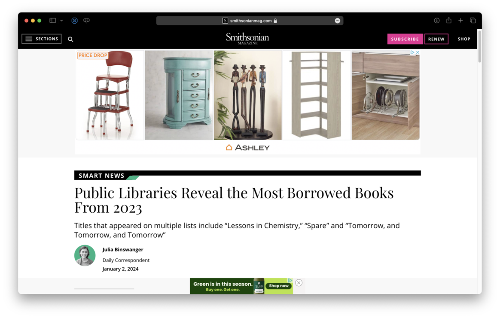
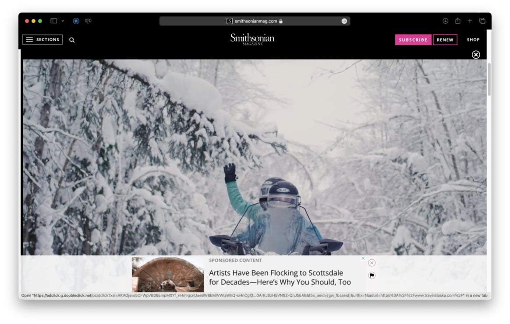
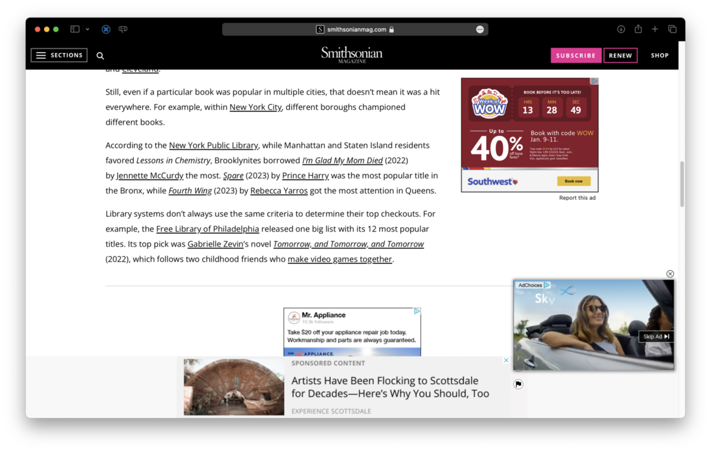

This is going to be one of those meaty, meandering, old school blog posts about... well blogging. Welcome back everyone.

With the fall of Twitter over the last several months there's predictably been some folks moving their online presence back to their personal websites. Similarly we've seen more calls for a return to the concepts of the "[IndieWeb][]" and [folks rightfully calling out that's it still too hard for people to own their own content][2].

One of the interesting things about the [Substack's product strategy to become the go-to place for radical hate content][5] is that a lot of the small, indie voices on Substack didn't know how to get off of it. Sure there are alternatives to Substack ([Buttondown][] or [Ghost][] come to mind) but they don't offer anywhere close to the "free tier" level of service Substack offered. (And they sure heck are not [offering one year of paid healthcare][6], holy moly.) Trying to wrangle how to get something like a self-hosted Wordpress instance to also act as a newsletter is surprisingly complicated. It is not that easy to send email in volume anymore because many of the large email-as-a-service providers (and international/regional laws) require a lot of safeguards to ensure emails are authentic, wanted, and not tracking you without your consent.

It is interesting to note that if Google Reader had managed to stick around I don't think there would have been as strong of a push to return to the newsletter format. (And Google Reader wasn't exactly an ideal RSS citizen either much less an "IndieWeb" friendly one.)

Anyway, I'm excited to see some movement back towards personal websites because I've also been thinking about bringing back my blogging habit. Somewhere around 2005 I threw in the towel on keeping a personal website "for realsies" because Twitter was just much easier to use. I've had a personal website since 1996, originally hosted on the free web space my ISP gave me and later moving it around to several different domain names and software systems. I've used Django, Drupal, Jekyll, Hugo, Movable Type, Wordpress, as well as quite a few bespoke applications I wrote to manage the site. These days this site is hosted & powered by [David Merfield's blot.im][1]. I'm writing software usually every other day and I don't need to add yet-another-thing to maintain to my daily brain-load. There's no lock-in with blot though - I own my domain, the content is in plain-text, and it is easy to obtain all the materials and go somewhere else that supports static website generation.

For several years now I've been microblogging on a [Mastodon instance run by Darius Kazemi][3]. I choose Darius's instance because Darius is a smart person who cares about the good parts of the federated networks (e.g. see [Darius and Erin Kissane's very recent announcement to organize research into "fediverse" governance][8]) Microblogging is great and it does feel like the "good years" of Twitter - for the most part (I don't remember there being so much mansplaining and contrarian posting for the sake of hearing yourself argue in the early days of Twitter but there were so many "micro-islands" of conversation at the beginning it was easy to not see the whole picture.) More often over the last few years I've found myself saying "this should really be a blog post" because threaded conversations on microblogs suck for any number of reasons. 

Over a year ago, Phil Gyford opened up [https://ooh.directory][4], which Phil describes as ["a collection of hundreds of blogs, to help people find good blogs that interest them."][7]. I was browsing through it this week and it was really uplifting to see so much interesting content that was just plain-spoken and not heavily packaged. 

As an example of "this should really be a blog post" - here's an example of the "heavily package" content experience that befuddles me. Jason Kottke had shared a link about the "most borrowed library books" that looked interesting. So I clicked on the link and the following happened:

It sucks to click on a link to an article and then only see the title of the article that I already decided I wanted to read as the only thing on the screen. I get it, websites cost money and need a business model to recoup that money - so ads. Was it really not possible to fit in more than just the title, byline, and a single sentence lede? That's okay though because even if more than the lede had been there before I could even scroll down my screen was covered with this:

I don't know what this is and I don't want it. I wanted to read an article and instead there was like a two minute montage of people skiing covering the entire viewport and there wasn't even "80s movie action" skiing music. Finally after I figured how to dismiss the ad and scroll down I was left with this mess:

This screenshot is hilarious for a number of reasons. First of all there are ads overlapping each other - so I can't even tell you what the ads are about. Content baby! Second, this paragraph is impossible to read because there are too many hyperlinks distracting me from just like... catching my breath and figuring out where to start reading. What's sad is I don't even know what the most borrowed library books were because I gave up trying to read the article at this point.

It is taken a while to get to here but in summary: let's bring back personal websites! Let's make them easier to setup - those of you savvy enough to do so need to file bugs and enhancement requests with your software folks to enable this. Let's bring back content you can actually read and let's figure out how to help people afford to self-host this stuff so they can post fun quirky things we can read and learn from.

[1]: https://blot.im
[2]: https://gilest.org/indie-easy.html
[3]: https://friend.camp
[4]: https://ooh.directory
[5]: https://www.techdirt.com/2024/01/10/substack-realizes-maybe-it-doesnt-want-to-help-literal-nazis-make-money-after-all/
[6]: https://www.platformer.news/p/why-platformer-is-leaving-substack
[7]: https://www.gyford.com/phil/writing/2022/11/23/oohdirectory/
[8]: https://write.as/fediversalist-papers/kicking-off-our-fediverse-research
[IndieWeb]: https://indieweb.org
[Buttondown]: https://buttondown.email
[Ghost]: https://ghost.org
